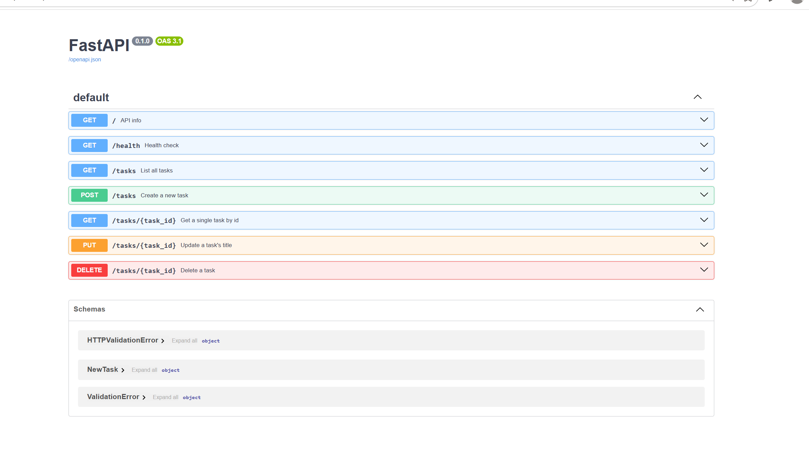
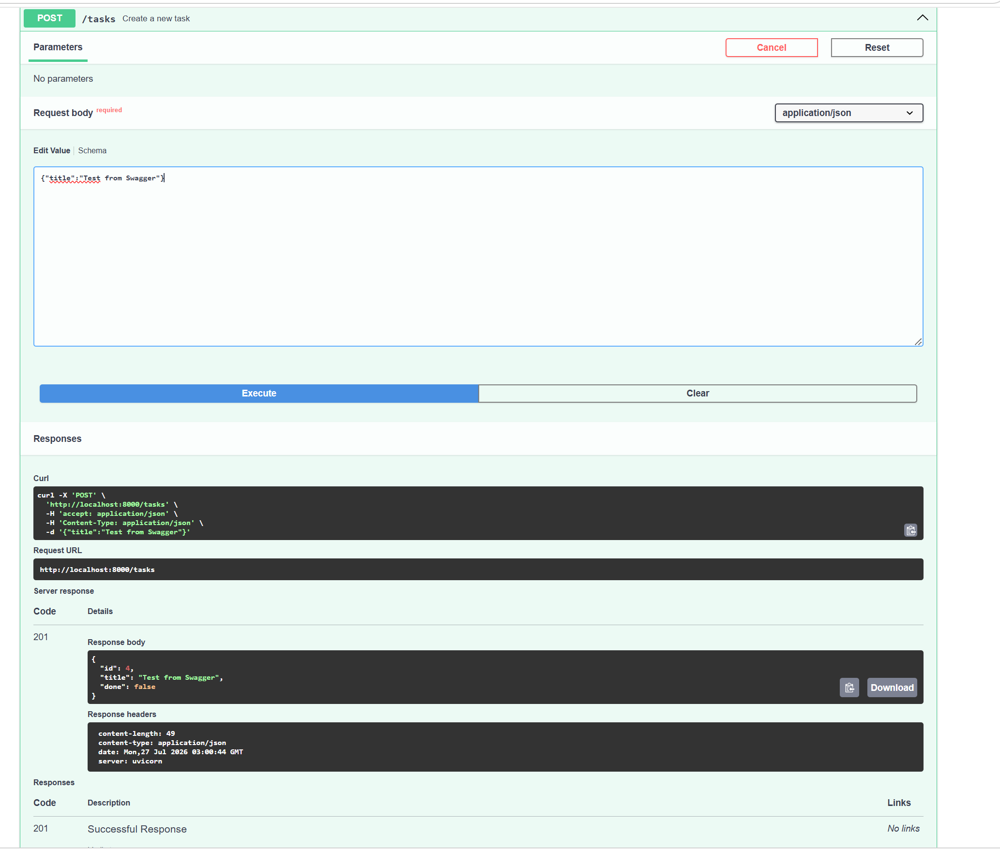
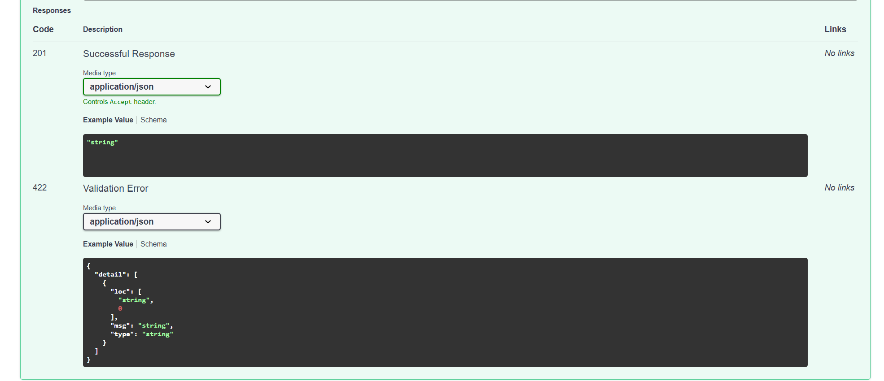

# Task API

A small CRUD (Create, Read, Update, Delete) API for managing a to-do list, built with FastAPI. Data is stored in memory — it resets whenever the server restarts.

## How to run it

1. Clone this repo and open a terminal in the project folder.
2. Create and activate a virtual environment:
```
python3 -m venv venv
venv\Scripts\activate       # Windows
source venv/bin/activate    # Mac/Linux
```

3. Install dependencies:
```
pip install fastapi uvicorn
```

4. Run the server:
```
uvicorn main:app --reload
```

5. Visit `http://localhost:8000/` in your browser, or `http://localhost:8000/docs` for the interactive Swagger UI.

## Endpoints

| Method | Path          | Description               |
|--------|---------------|----------------------------|
| GET    | `/`           | API info                   |
| GET    | `/health`     | Health check                |
| GET    | `/tasks`      | List all tasks              |
| GET    | `/tasks/{id}` | Get a single task by id      |
| POST   | `/tasks`      | Create a new task            |
| PUT    | `/tasks/{id}` | Update a task's title         |
| DELETE | `/tasks/{id}` | Delete a task                |

## Example request

curl.exe -i -X POST http://localhost:8000/tasks -H "Content-Type: application/json" -d '{"title":"Buy milk"}'


Response:

HTTP/1.1 201 Created
content-type: application/json

{"id":4,"title":"Buy milk","done":false}


## Swagger UI

Interactive docs are available at `/docs` once the server is running.







## Notes on in-memory storage

Since tasks are stored in a Python list rather than a database, all data resets to the 3 example tasks every time the server restarts (including every time `--reload` detects a file change). This is expected — persistent storage is planned for a future stage.